<div align="center">
  <a href="https://github.com/EddieOoi">
    
  </a>
</div>

<br />

<div align="center">
  <a href="https://linkedin.com/in/eddieooi">
    
  </a>
  <a href="https://linktr.ee/eddie.ooi">
    
  </a>
  <a href="https://eddieooi.itch.io/delights-despair">
    
  </a>
  <a href="https://eddieooi.github.io/3ddGemu-Portfolio/">
    
  </a>
  <a href="https://sanguine-echoes.vercel.app/">
    
  </a>
  <a href="https://facebook.com/eddie.ooiweikit">
    
  </a>
  <a href="https://instagram.com/weikit_001/">
    
  </a>
</div>

<br />

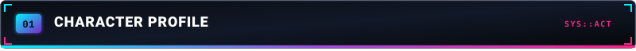

<div align="center">
  <a href="https://github.com/EddieOoi">
    
  </a>
</div>

<!-- TERMINAL PORTRAIT & CONTRIBUTION HEATMAP -->
<div align="center">
  <h3><code>eddie@github ~ $ ./render_profile.sh --ascii</code></h3>
  
  
  <br /><br />
  
  <h3><code>eddie@github ~ $ ./contributions.sh --matrix</code></h3>
  
</div>

<br />

---
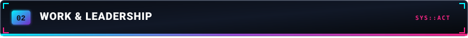

<div align="center">
  <a href="https://github.com/EddieOoi">
    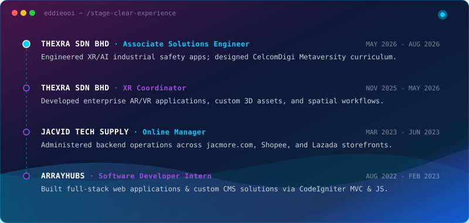
  </a>
</div>
</br>
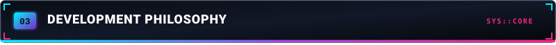

<div align="center">
  <a href="https://github.com/EddieOoi">
    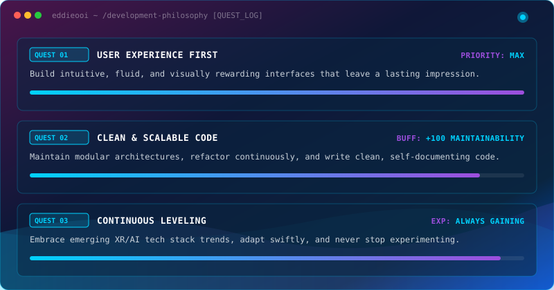
  </a>
</div>

---

<!-- SECTION 04: TECH STACK -->
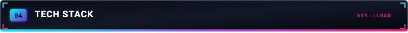

<br />

<!-- LANGUAGES -->


<div align="center">
  
  
  
  
  
  
  
  
  
  
</div>

<br />

<!-- FRAMEWORKS & WEB -->
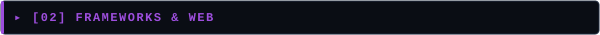

<div align="center">
  
  
  
  
  
  
  
</div>

<br />

<!-- XR, 3D & GRAPHICS -->


<div align="center">
  
  
  
  
  
  
</div>

<br />

<!-- AI & DATA SCIENCE -->
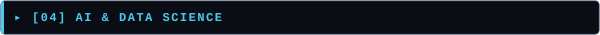

<div align="center">
  
  
  
  
  
</div>

<br />

<!-- TOOLS & PLATFORMS -->


<div align="center">
  
  
  
  
  
  
  
  
  
  
  
  
</div>

---

<!-- SECTION 05: LEVEL PROGRESSION -->
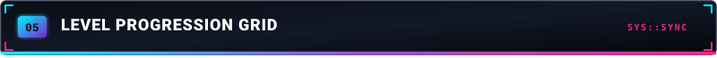

<br />

<!-- GAMIFIED CONTRIBUTION GRIDS -->
<div align="center">
  <h3><code>eddie@github ~ $ ./start_arcade.sh</code></h3>

  <!-- 1. Snake Game Section -->
  
  <br />
  <br />
  
  <br />
  <br />
  
  <br />
  <br />

  <!-- 2. Spaceship Shooter Section -->
  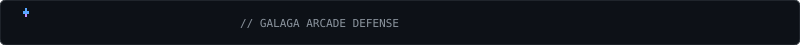
  <br />
  <br />
  
  <br />
  <br />

  <!-- 3. Pacman Section -->
  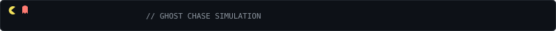
  <br />
  <br />
  
  <br />
  <br />

  <!-- 4. Bomberman Section -->
  
  <br />
  <br />
  <picture>
    <source media="(prefers-color-scheme: dark)" srcset="https://raw.githubusercontent.com/EddieOoi/EddieOoi/output/bomberman-contribution-graph-dark.svg">
    <source media="(prefers-color-scheme: light)" srcset="https://raw.githubusercontent.com/EddieOoi/EddieOoi/output/bomberman-contribution-graph.svg">
    
  </picture>
</div>

<br />

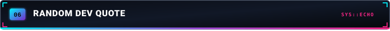

<div align="center">
  
</div>

---
<div align="center">
  <a href="https://github.com/EddieOoi">
    
  </a>
</div></br>

```text
$ git diff dev-mindset.config
@@ -1,4 +1,4 @@
- status: learning basics
+ status: building immersive realities & full-stack apps
- sleep_hours: 8
+ sleep_hours: "it's a floating point number"
- current_level: junior
+ current_level: leveling up continuously ⚡
