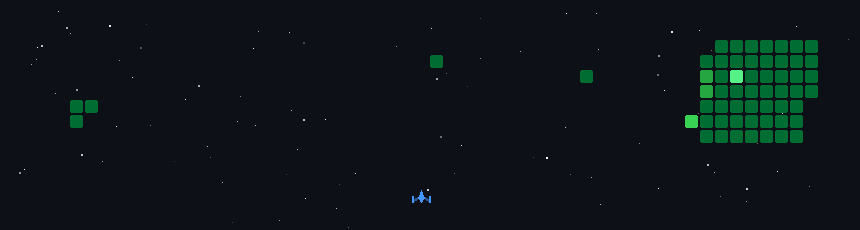

<div align="center">
  <div style="position: relative; display: inline-block; width: 300px;">
    
  </div>
  <h2>Hi, I'm Eddie</h2>

</div>

## 🌐 Connect & Links:

<div align="center">
  <a href="https://linkedin.com/in/eddieooi">
    
  </a>
  <a href="https://eddieooi.itch.io/delights-despair">
    
  </a>
  <a href="https://eddieooi.github.io/3ddGemu-Portfolio/">
    
  </a>
  <a href="mailto:eddie.weikit@gmail.com">
    
  </a>
  <a href="https://facebook.com/eddie.ooiweikit">
    
  </a>
  <a href="https://instagram.com/weikit_001/">
    
  </a>
</div>

---

## 🚀 Character Profile

I am a passionate interactive developer based in Klang, Selangor, Malaysia. My expertise lies in interactive software technology, XR development, and web programming. I recently completed my Bachelor in Computer Science (Honours) from Tunku Abdul Rahman University of Management and Technology (TAR UMT). I love turning complex logic into immersive digital solutions and digitalizing workflows to solve real-world challenges.

> 🟩 **Dev Creed:** *"If it’s interactive, immersive, or impactful, I’m building it."* 💪💪

---

## 💫 About Me

* 🔭 **I’m currently working on:** Building interactive XR, AI-driven applications, and full-stack web solutions.
* 👯 **I’m looking to collaborate on:** Immersive software technology, AR/VR experiences, and creative web programming projects.
* 🤝 **I’m looking for help with:** Advanced 3D asset optimization and scaling multiplayer interactive frameworks.
* 🌱 **I’m currently learning:** Next-level XR interaction models, advanced full-stack architectures, and AI integration.
* 💬 **Ask me about:** XR/AR/VR development, Unity, C#, CodeIgniter, or web programming.
* ⚡ **Fun fact:** Sleep hours = a floating point number. If it’s interactive, immersive, or impactful, I’m building it!

---
## 🏆 Stage Clear: Work & Leadership

* **Associate Solutions Engineer at THEXRA SDN BHD** *(May 2026 - August 2026)*  
  Engineered immersive XR and AI-driven applications for industrial safety training, and designed a comprehensive XR curriculum for the CelcomDigi Metaversity Internship Programme.
* **XR Coordinator at THEXRA SDN BHD** *(Nov 2025 - May 2026)*  
  Developed AR/VR applications and custom 3D assets, driving the end-to-end deployment of enterprise XR solutions.
* **Online Manager at Jacvid Technology Supply & Service** *(March 2023 - June 2023)*  
  Administered backend server operations for e-commerce storefronts across jacmore.com, Shopee, and Lazada.
* **Software Developer Intern at ArrayHubs** *(August 2022 - February 2023)*  
  Developed responsive web applications and custom WordPress CMS solutions using the CodeIgniter MVC framework, HTML, CSS, and JavaScript/jQuery.

---

## 💡 Development Philosophy

* 💡 **Core Loop:** Turn complex logic into immersive, real-world digital experiences.
* 🚀 **Deploy > Overthink:** Ideas are great, but working code in production is better.
* 👥 **Multiplayer Mindset:** Passionate about building strong team dynamics, guiding projects from initial spawn to final boss.

---

## 💻 Tech Stack

### Languages
        

### Frameworks & Web
     

### XR, 3D & Graphics
    

### AI & Data Science
   

### Tools & Platforms
         

---

## 👾 Level Progression Grid

<div align="center">
  
  <br /><br />
  
</div>

### ✍️ Random Dev Quote


---


```text
$ git diff dev-mindset.config
@@ -1,4 +1,4 @@
- status: learning basics
+ status: building immersive realities & full-stack apps
- sleep_hours: 8
+ sleep_hours: "it's a floating point number"
- current_level: junior
+ current_level: leveling up continuously ⚡
